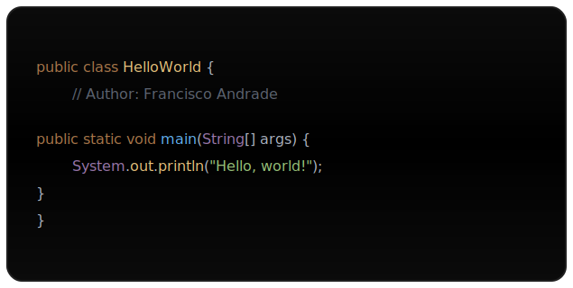
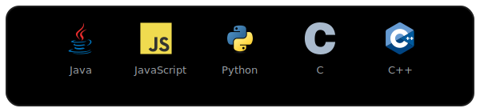
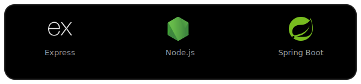
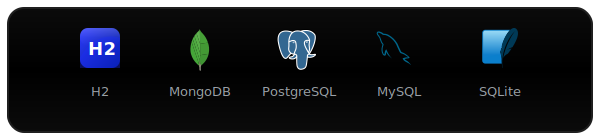
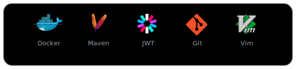
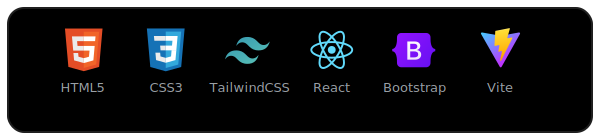
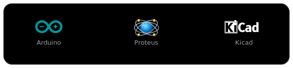
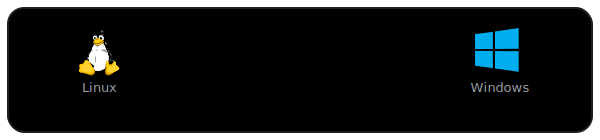
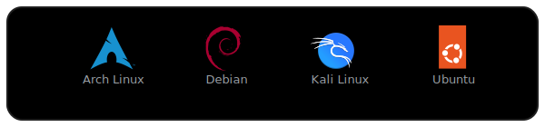

<h1 align="center">Hi 🌎, I'm Francisco Andrade</h1>

<h3 align="center">Full Stack Developer | Electronics Enthusiast | Designer</h3>

<!-- Code card (imagen local para respetar colores exactamente) -->

  

## 👨‍💻 About Me

- 🔭 I'm currently working on backend development with **Spring Boot**
- 🌱 I'm currently learning **Spring Boot**, **Docker**, and **Microservices Architecture**
- 💡 Passionate about **electronics**, **programming**, and **design**
- 📫 Reach me at: **fran.eze.andrad@gmail.com**

## 🌐 Connect with me

  

## 💻 Programming & Backend

### 🧩 Languages & Tools

  

### ⚙️ Backend & Frameworks

  

### 🗄 Databases

  

### 🛠 DevOps & Tools

  

## 🎨 Frontend & Web Design

  

## ⚡ Electronics & Hardware

  

## 💻 Operating Systems

  

<h3 align="center">🐧 Linux Distributions</h3>

  

## 📊 GitHub Stats

  <!-- Fila 1: Top Langs + Stats (stats sin include_all_commits / count_private) -->
  

    

  
  

  <!-- Fila 2: Streak (endpoint estable) -->
  

    
  

  <!-- Fila 3: Trophies -->
  

    
  

--- 

  <i>⚡ "The only way to do great work is to love what you do" - Steve Jobs</i> 
  Logos stored locally or from official sources for reliability.

