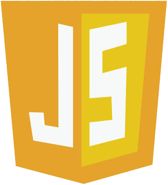
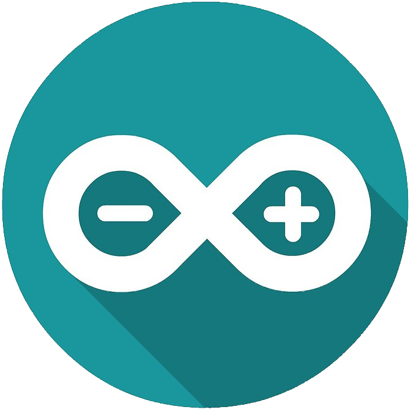

<h1 align="center">Hi 🌎, I'm Francisco Andrade</h1>
 

  

  

- 🌱 I’m currently learning **java**

- 📫 How to reach me **fran.eze.andrad@gmail.com**

 
<h3 align="left">Connect with me:</h3>

  

<h3 align="left">Languages and Tools:</h3>

 
 

 

 

 
 
 
 
   

  

<h3 align="left">Using operating systems:</h3>

  

&nbsp;

<!-- 
 
 -->

  

